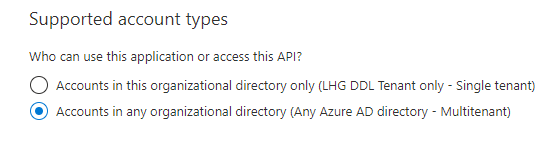

# Azure Multi-Tenant

## Steps

1. Configure both the UI and API app registrations to be multi-tenant
   Azure Active Directory -> Authentication
   Switch from Single Tenant to Multitenant
   

2. Update your code so that  
   a. The login request is done via <https://login.microsoftonline.com/organizations/v2.0>  
   b. The requested scope is xxxxx/.default

3. Create the roles
4. Restrict the allowed tenant ID's in the API and UI if requested
5. Request an admin to approve

## resources

- <https://docs.microsoft.com/en-us/azure/active-directory/develop/scenario-protected-web-api-app-configuration>
