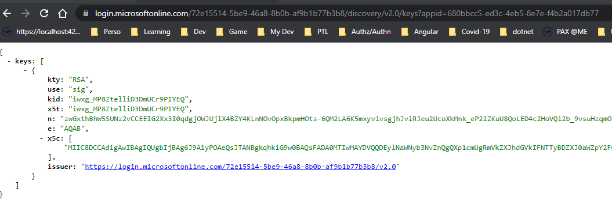

# JWT token

JSON Web Tokens consist of three parts separated by dots (.), which are:

- Header
- Payload
- Signature

Therefore, a JWT typically looks like the following.

```text
xxxxx.yyyyy.zzzzz
```

## JWT Header

```json
{
  "typ": "JWT",
  "alg": "RS256",
  "kid": "iwxg_MP8ZtelliD3DmUCr9PIYEQ"
}
```

## JWT Payload

```json
{
  "aud": "api://91bd7a9d-ad61-4bda-a738-56e3d38f4860",
  "iss": "https://sts.windows.net/c7c91135-2f63-4ba4-ab4f-3c7e7ffc5d92/",
  "iat": 1636618478,
  "nbf": 1636618478,
  "exp": 1636622378,
  "acr": "1",
  "aio": "AWQAm/8TAAAAYC9VywF/H8l7gd8lum73gEHvhrNEQhEocFyCnaazX4+WNl2SM/Bj2Dij4+lUeWxPrGmID0/+UUq0nbPgofjgLr4k3fhg1/C6TZGZrxgH/mvYC/3uUIaj+MiWIuWeV4jv",
  "amr": ["wia"],
  "appid": "a69f5305-d5c9-49e9-a569-1d6ae782725b",
  "appidacr": "0",
  "email": "Maxime.Matter@swiss.com",
  "idp": "https://sts.windows.net/72e15514-5be9-46a8-8b0b-af9b1b77b3b8/",
  "ipaddr": "146.216.2.66",
  "name": "MATTER, MAXIME",
  "oid": "f6dfa202-21f6-490b-8715-b5b7e2989f4f",
  "rh": "0.ATAANRHJx2MvpEurTzx-f_xdkgVTn6bJ1elJpWkdaueCclswAMQ.",
  "roles": ["Administrator"],
  "scp": "Api.Use",
  "sub": "zOSrr_iOz9A1g75rcAgNWA5pF9HPC1W_y2Kbchz4qD4",
  "tid": "c7c91135-2f63-4ba4-ab4f-3c7e7ffc5d92",
  "unique_name": "Maxime.Matter@swiss.com",
  "uti": "f3UXdLWEWku5wztBCAYlAA",
  "ver": "1.0"
}
```

## JWT Signature

**TODO**

### Claims

| Claim   | Description              |                                                                                                                                                                                                                                                                                                                                                                                                                                            |
| ------- | ------------------------ | ------------------------------------------------------------------------------------------------------------------------------------------------------------------------------------------------------------------------------------------------------------------------------------------------------------------------------------------------------------------------------------------------------------------------------------------ |
| aud     | Audience                 | Identifies the recipients that the JWT is intended for. The audience is your app's Application ID, assigned to your app in the Azure portal.                                                                                                                                                                                                                                                                                               |
| iss     | Issuer                   | Identifies the principal that issued the JWT. It also identifies the Azure AD tenant for which the user was authenticated.                                                                                                                                                                                                                                                                                                                 |
| idp     | Identity Provider        | Records the identity provider that authenticated the subject of the token. This value is identical to the value of the Issuer claim unless the user account not in the same tenant as the issuer - guests, for instance.                                                                                                                                                                                                                   |
| oid     | Object ID                |                                                                                                                                                                                                                                                                                                                                                                                                                                            |
| roles   | Roles                    | ID token: The set of roles that were assigned to the user who is logging in. Access Token: The set of permissions exposed by your application that the requesting application or user has been given permission to call. For application tokens, this is used during the client credential flow (v1.0, v2.0) in place of user scopes. For user tokens this is populated with the roles the user was assigned to on the target application. |
| tid     | Tenant ID                | Represents the tenant that the user is signing in to. For work and school accounts, the GUID is the immutable tenant ID of the organization that the user is signing in to. To receive this claim, your app must request the profile scope.                                                                                                                                                                                                |
| ccp     | Scope                    | The set of scopes exposed by your application for which the client application has requested (and received) consent. Your app should verify that these scopes are valid ones exposed by your app, and make authorization decisions based on the value of these scopes.                                                                                                                                                                     |
| sub     | User Identifier?         |
| In_corp | Inside Corporate Network | Signals if the client is logging in from the corporate network. If they're not, the claim isn't included. Based off of the trusted IPs settings in MFA.                                                                                                                                                                                                                                                                                    |
| upn     | UserPrincipalName        |                                                                                                                                                                                                                                                                                                                                                                                                                                            |

### References

- <https://datatracker.ietf.org/doc/html/rfc7519>
- <https://docs.microsoft.com/en-us/azure/active-directory/develop/id-tokens>
- <https://docs.microsoft.com/en-us/azure/active-directory/develop/access-tokens>

## Token validation

The token is encrypted using the Identity Provider's private key and needs to be validated using the corresponding public key.

The set of public key can be found under the oauth keys endpoint.



Endpoint to see the openid configuration file:
<https://login.microsoftonline.com/72e15514-5be9-46a8-8b0b-af9b1b77b3b8/v2.0/.well-known/openid-configuration>

Endpoints to see LH Group tenant public keys: <https://login.microsoftonline.com/72e15514-5be9-46a8-8b0b-af9b1b77b3b8/discovery/v2.0/keys>

Each key provided by the identity provider has a key ID (kid) which is the identifier of the public key to use in order to verify the token signature.

In the header of the JWT token we can find the information which key we need to use in order to validated the token.

```json
{
  "typ": "JWT",
  "alg": "RS256",
  "kid": "iwxg_MP8ZtelliD3DmUCr9PIYEQ"
}
```

We can see that the kid `iwxg_MP8ZtelliD3DmUCr9PIYEQ` is matching the kid provided by the key endpoint.

### References

- <https://blogs.aaddevsup.xyz/2019/03/using-jwt-io-to-verify-the-signature-of-a-jwt-token>
- <https://docs.microsoft.com/en-us/azure/active-directory/develop/active-directory-claims-mapping>
- <https://developer.forgerock.com/docs/platform/how-tos/json-web-signatures-kids-and-thumbprints-sticking-standards>
- <https://docs.microsoft.com/en-us/azure/active-directory/develop/v2-protocols-oidc>
